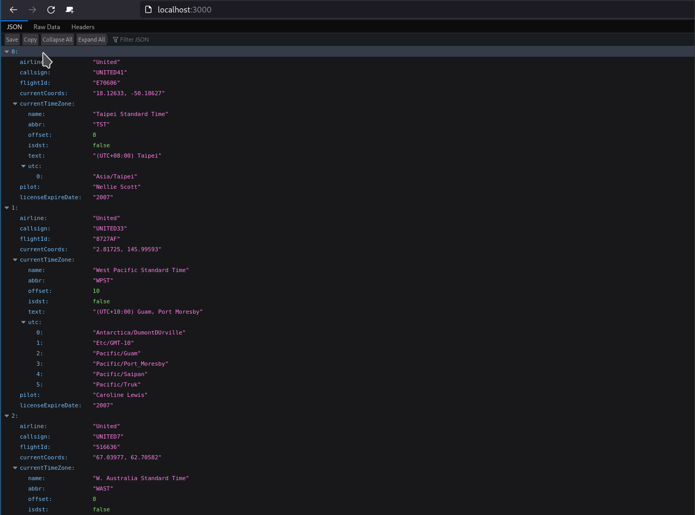
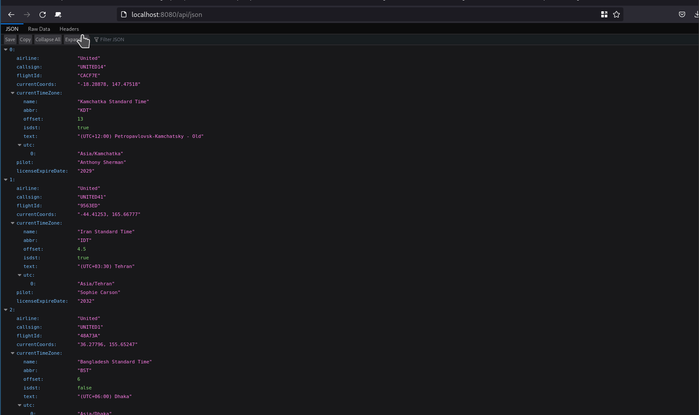
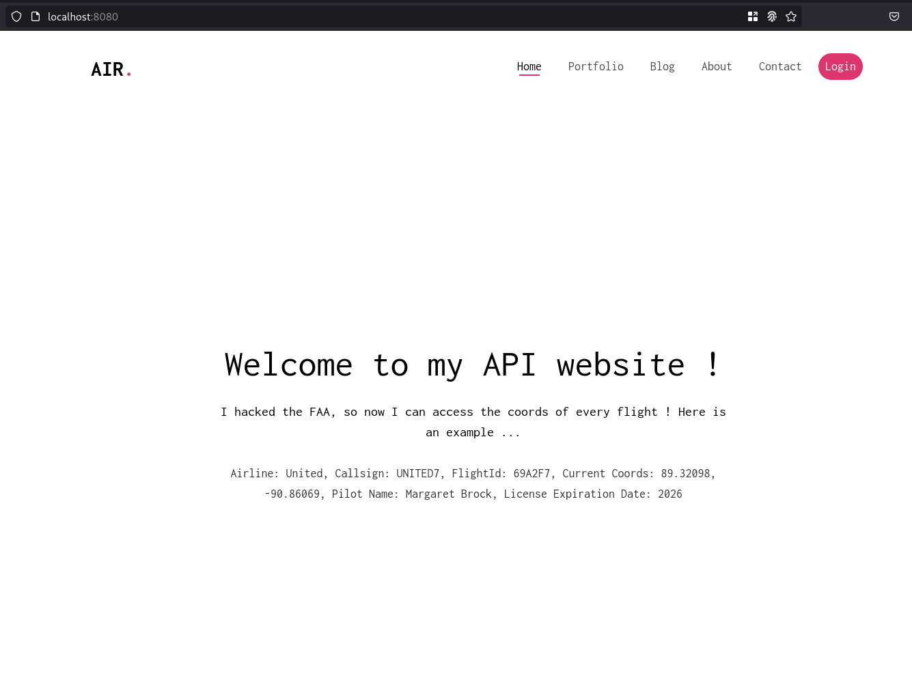
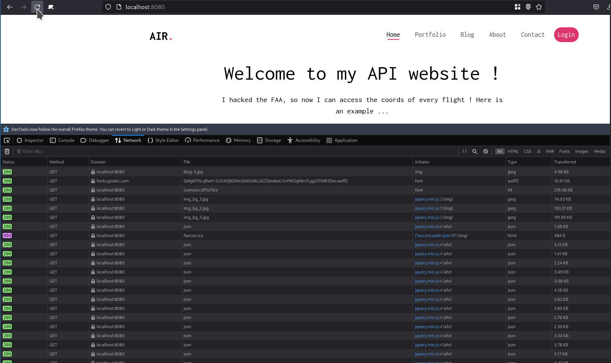

# API - Labo HTTP
Auteurs : Anthony Coke, Francesco Monti

## Etape 1: Serveur HTTP statique avec apache httpd
Nous avons décidé d'utiliser l'image *php:8.0-apache*. Le dossier contenant le site web statique est copié dans le répertoire
`/var/www/html` du conteneur.

Le fichier Dockerfile contient :
```
FROM php:8.0-apache

RUN apt-get update && apt-get install -y vim

COPY content/ /var/www/html/

EXPOSE 8080
```
Explications: l'image construite est basée sur php:8.0-apache. Le noyau est mis à jour et l'outil *vim* est installé. Le contenu du répertoire *content/* est copié dans le container à l'emplacement `/var/www/html/`. Finalement, le port *8080* est exposé.

L'image peut être construite à l'aide de la commande suivante dans le répertoire contenant le Dockerfile :

```
docker build -t infra/static .
```
Une fois cela fait, le container peut être démarré 

```
docker run -p 8080:80 infra/static
```

### Résultat
Maintenant, il peut être accédé via [localhost:8080](http://localhost:8080). 


## Etape 2: Serveur HTTP dynamique avec fastify.js

Le fichier server.js permet de créer un serveur utilisant le module Fastify.

```js
// On dit qu'on utilise le module Chance qui permet de générer des données aléatoirement
import Chance from 'chance';
import Fastify from 'fastify';

const fastify = Fastify({
   logger: true
});
const chance = Chance();
const port = process.env.PORT;

/* Lors d'un accès à la racine du site, le serveur va générer une charge utile JSON et la renvoyer */
fastify.get('/', (request, reply) => {
   reply.send(generateJSON());
});

/* Le serveur écoute les requêtes sur le port 3000 */
const start = async () => {
   try {
      await fastify.listen(port, '0.0.0.0')
   } catch (err) {
      fastify.log.error(err)
      process.exit(1)
   }
}

/* Fonction qui génère une charge utile JSON avec des informations sur des vols de la compagnie aérienne United */
function generateJSON() {

	var numberOfPlanes = chance.integer({
		min: 0,
		max: 10
	});
	console.log(numberOfPlanes);
	var planes = [];
	for (var i = 0; i < numberOfPlanes; ++i) {
	
		var airline = "United";
		var callsign = airline.toUpperCase() + chance.integer({min:1, max:45});
		var flightId = chance.hash({length: 6, casing: 'upper'})
		var currentCoords = chance.coordinates();
		var currentTimeZone = chance.timezone();
		var pilot = chance.name();
		var licenseExpireDate = chance.year({min: 2005, max: 2035});
		
		planes.push({
			airline: airline,
			callsign: callsign,
			flightId: flightId,
			currentCoords: currentCoords,
			currentTimeZone: currentTimeZone,
			pilot: pilot,
			licenseExpireDate: licenseExpireDate
		});
		
	};
	console.log(planes);
	return planes;
}

// Démarre le serveur
start();

```

Pour démarrer le serveur, nous utilisons cette fois un fichier `docker-compose.yml`. 
```
version: '3'
services:
  fastify:
    container_name: fastify-dynamic
    build: .
    ports:
      - "3000:3000"
    environment:
      - PORT=3000
```
Nous définissons un service *fastify*, chaque container de ce service utilisera l'image construite à l'aide du Dockerfile dans le répertoire courant. Le service est accessible via le port 3000.

```
FROM node:alpine

WORKDIR /opt/app

COPY --chown=node:node ./content/package*.json ./

RUN npm install

COPY --chown=node:node ./content .

USER node

ENTRYPOINT [ "node", "server.js" ]
```
Nous avons au préalable généré des fichiers `package.json` (et donc `package-lock.json`). Ces derniers permettront d'installer toutes les dépendances lors de l'exécution de la commande `npm install`.
Tous les fichiers du répertoire `content` sont copiés dans le répertoire de travail du container, c'est-à-dire `/opt/app`. Finalement, le fichier `server.js` est exécuté.

Pour démarrer le container en mode détaché, utiliser la commande suivante :
```
docker compose up -d
```
Pour arrêter tous les containers :
```
docker compose down
```

### Résultat
À chaque rafraîchissement de [localhost:3000](localhost:3000), les données affichées sont bien différentes.




## Etape 3: Reverse proxy avec apache (configuration statique)

AJOUTER SAME ORIGIN POLICY

Nous utilisons ici un serveur php-apache comme reverse proxy. 

```
FROM php:8-apache

RUN apt-get update && apt-get install vim -y

COPY conf/ /etc/apache2/

RUN a2enmod proxy proxy_http

RUN a2ensite 000-* 001-*
```
Nous copions tout le contenu du répertoire `conf/` dans `/etc/apache2/`. Cela va donc transférer tous les fichiers de configuration des hôtes virtuels. Puis, nous activons les modules proxy et proxy_http qui nous permettrons de mettre en place le routage. Finalement, nous activons les hôtes virtuels commençant par 000-* et 001-*, cela aura pour effet de copier les fichiers de configuration dans le répertoire `/etc/apache2/sites-enable`.

Le fichier de configuration *001-reverse-proxy.conf* permet de configurer le routage du proxy. Si l'URL correspond à *localhost:XXXX/api/json*, il y aura une redirection vers le container dynamic. Si l'URL correspond à la racine du nom de domaine, cette fois la requête ira vers le serveur statique.
```
<VirtualHost *:80>
	
	ServerName localhost

	ProxyPass "/api/json" "http://dynamic:3000/"
	ProxyPassReverse "/api/json" "http://dynamic:3000/"
	
	ProxyPass "/" "http://static:80/"
	ProxyPassReverse "/" "http://static:80/"
	

	ErrorLog ${APACHE_LOG_DIR}/error.log
	CustomLog ${APACHE_LOG_DIR}/access.log combined
	
</VirtualHost>
```

Si l'URL ne correspond pas à celles spécifiées précédemment, le serveur ne renvoit rien (fichier `000-default.conf`).
```
<VirtualHost *:80>
</VirtualHost>
```

Nous utilisons encore une fois un fichier `docker-compose.yml` pour démarrer l'infrastructure.

```
version: '3'
services:
  reverse-proxy:
    container_name: reverse-proxy
    build: ./reverse-proxy
    ports:
      - "8080:80"
    depends_on:
      - static
      - dynamic
  static:
    container_name: static
    build: ./static
  dynamic:
    container_name: dynamic
    build: ./dynamic
    environment:
      - PORT=3000
```

Le fichier est similaire à celui de l'étapte précédente, mais cette fois 3 services sont déclarés. Le seul service accessible par l'extérieur grâce au port-forwarding est le reverse-proxy. Pour les deux autres, aucune règle n'est spécifiée, mais bien évidemment les containers pourront tout à fait communiquer et recevoir des requêtes à l'intérieur du réseau.

Pour démarrer l'infrastructure en mode détaché, utiliser la commande suivante :
```
docker compose up -d
```
Pour arrêter tous les containers :
```
docker compose down
```

### Résultats

Si l'on accède à [localhost:8080/api/json](localhost:8080/api/json) les données JSON générées aléatoirement sont affichées, tandis qu'en accédant à [localhost:8080](localhost:8080) le site web statique s'affiche correctement.



## Etape 4: Requêtes AJAX avec JQuery

Le code html a été modifié et une classe a été ajoutée à la balise *<p>*. Cette classe permettra de sélectionner le paragraphe et en changer les propriétés grâce au script JS.

```html
	<header id="fh5co-header" class="fh5co-cover js-fullheight" role="banner">
		<div class="overlay"></div>
		<div class="container">
			<div class="row">
				<div class="col-md-8 col-md-offset-2 text-center">
					<div class="display-t js-fullheight">
						<div class="display-tc js-fullheight animate-box" data-animate-effect="fadeIn">
              
							<h1>Welcome to my API website !</h1>
							<h2>I hacked the FAA, so now I can access the coords of every flight ! Here is an example ...</h2>
							<p class="json-app">There's nothing here ... :(</p>
              
						</div>
					</div>
				</div>
			</div>
		</div>
	</header>
```

À la fin du fichier `index.html`, il faut bien évidemment indiquer où aller chercher le script.

```html
	<!-- Custom script to load flights information -->
	<script src="js/flights.js"></script>

	</body>
</html>

```

Le script `flight.js` suivant exécute la fonction *loadFlights()* toutes les 2 secondes. Cette dernière va récupérer les données JSON en faisant une requête GET à l'URL `/api/json/`. S'il y a des données à afficher, un message sera composé avec les données du premier vol du tableau JSON. Finalement, le text contenu dans la balise utilisant la classe `json-app` est mis à jour.

```js
$(function() {
	console.log("Loading flights...");
	
	function loadFlights() {
		$.getJSON("/api/json/", function( flights ) {
			console.log(flights);
			var message = "No flights recorded...";
			if (flights.length > 0) {
				message = "Airline: " + flights[0].airline + ", Callsign:  " +
					flights[0].callsign + ", FlightId: " + 
					flights[0].flightId + ", Current Coords: " +
					flights[0].currentCoords + ", Pilot Name: " + 
					flights[0].pilot + ", License Expiration Date: " +
					flights[0].licenseExpireDate; 
			}
			$(".json-app").text(message);
		});
	};
	loadFlights();
	setInterval(loadFlights, 2000);
});
```

```
version: '3'
services:
  reverse-proxy:
    container_name: reverse-proxy
    build: ./reverse-proxy
    ports:
      - "8080:80"
    depends_on:
      - static
      - dynamic
  static:
    container_name: static
    build: ./static
  dynamic:
    container_name: dynamic
    build: ./dynamic
    environment:
      - PORT=3000
```

La configuration de l'infrastructure dans le docker-compose est la même qu'à l'étape précédente. En effet, les seules modifications faites se trouvent dans les fichiers du site web. Il suffit simplement de reconstruire l'image *static* et les changements seront pris en compte.

### Résultats

En accédant au site web via [localhost:8080](localhost:8080), la page d'accueil est mise à jour toutes les 2 secondes et affiche correctement les données JSON.



Si nous inspectons les requêtes dans l'onglet *Network* des outils développeur du navigateur, nous voyons bien que toutes les 2 secondes une requête est envoyé à `/api/json`.



## Etape 5: Configuration dynamique du reverse proxy
Les fonctionnalités demandées à cette étape ont déjà été implémentées à l'étape 3.

# Étapes supplémentaires

Pour les prochaines étapes, nous passerons d'un proxy inversé Apache à un utilisant l'outil Traefik.

Traefik est un reverse-proxy HTTP très moderne qui permet de gérer facilement le routage, la répartition de charge. Il dispose de plein d'autres fonctionnalités très intéressantes et utiles.

## Répartition de charge : plusieurs noeuds serveurs

Nous nous basons sur l'état final de l'étape 5, c'est-à-dire que les images et le contenu des répertoires `dynamic/` et `static/` n'a pas changé.

Nous utilisons donc un fichier `docker-compose.yml`. 

```
services: 
 traefik: 
  image: "traefik:v2.5"
  command: --api.insecure=true --providers.docker
  ports:
   - "${FRONT_HTTP_PORT:-9090}:80"
   - "8080:8080"
  volumes:
   - /var/run/docker.sock:/var/run/docker.sock

  environment:
   - TRAEFIK_PROVIDERS_DOCKER_EXPOSEDBYDEFAULT=false
   - TRAEFIK_PROVIDERS_DOCKER=true
   - TRAEFIK_ENTRYPOINTS_FRONT=true
   - TRAEFIK_ENTRYPOINTS_FRONT_ADDRESS=${FRONT_HTTP_PORT:-9090}
```
Nous définissons à un service qui utilisera l'image de traefik. Les commandes permettent d'activer l'interface utilisateur et de dire à traefik qu'il doit écouter les évènements et récupérer les données grâce à l'API docker. Il faut ajouter le volume `/var/run/docker.sock:/var/run/docker.sock`. Le port forwarding "8080:8080" permet d'accéder à l'interface de gestion via [localhost:8080](localhost:8080) et "9090:80" servira à se rendre sur le [site web](localhost:9090).

Puis, nous ajoutons des variables d'environnement pour désactiver l'exposition par défaut, activer l'utilisation de docker comme provider, activer un entrypoint front et spécifier le port d'accès à cet entrypoint.

^ À revoir ... ^

```
deploy:
 replicas: 2
```
Cela permet de démarrer deux containers avec la même image.

```
  labels: 
   - traefik.enable=true
   - traefik.http.services.static.loadbalancer.server.port=80
   - traefik.http.routers.static.rule=PathPrefix(`/`)
```
Le service est exposé à traefik (pour qu'il puisse le gérer dynamiquement), puis le port de communication (*:80*) utilisé par le container. Le dernier label sert à déclarer un router qui redirigera la requête HTTP sur ce service si la requête tente d'accéder à la racine du nom de domaine.

```
  labels: 
   - traefik.enable=true
   - traefik.http.services.dynamic.loadbalancer.server.port=3000
   - traefik.http.routers.dynamic.rule=PathPrefix(`/api/json`)
   - traefik.http.routers.dynamic.middlewares=dynamic-replacepath
   - traefik.http.middlewares.dynamic-replacepath.replacepath.path=/
```
Les règle sont relativement similaires pour le service dynamic, mais cette fois lorsqu'une requête est envoyé à /api/json, le routeur va la modifier pour qu'elle soit redirigée à la racine du service.

```
  environment:
  - PORT=3000
```
Je ne sais plus pourquoi cette variable d'environnement est nécessaire...

**Fichier final:**
```
version: "3"

services: 
 traefik: 
  image: "traefik:v2.5"
  command: --api.insecure=true --providers.docker
  ports:
   - "${FRONT_HTTP_PORT:-9090}:80"
   - "8080:8080"
  volumes:
   - /var/run/docker.sock:/var/run/docker.sock

  environment:
   - TRAEFIK_PROVIDERS_DOCKER_EXPOSEDBYDEFAULT=false
   - TRAEFIK_PROVIDERS_DOCKER=true
   - TRAEFIK_ENTRYPOINTS_FRONT=true
   - TRAEFIK_ENTRYPOINTS_FRONT_ADDRESS=${FRONT_HTTP_PORT:-9090}

 static:
  build: ./static
  deploy:
   replicas: 2
  labels: 
   - traefik.enable=true
   - traefik.http.services.static.loadbalancer.server.port=80
   - traefik.http.routers.static.rule=PathPrefix(`/`)
   
 dynamic: 
  build: ./dynamic
  deploy:
   replicas: 2
  labels: 
   - traefik.enable=true
   - traefik.http.services.dynamic.loadbalancer.server.port=3000
   - traefik.http.routers.dynamic.rule=PathPrefix(`/api/json`)
   - traefik.http.routers.dynamic.middlewares=dynamic-replacepath
   - traefik.http.middlewares.dynamic-replacepath.replacepath.path=/
  environment:
  - PORT=3000
```

### Résultats


## Répartition de charge : round-robin vs sticky sessions

Deux labels ont été rajoutés dans chaque service pour activer les sticky sessions :

```
   - traefik.http.services.dynamic.loadbalancer.sticky=true
   - traefik.http.services.dynamic.loadbalancer.sticky.cookie.name=<Nom_désiré>
```

**Fichier final:** 

```
version: "3"

services: 
 traefik: 
  image: "traefik:v2.5"
  container_name: traefik
  command: --api.insecure=true --providers.docker
  ports:
   - "${FRONT_HTTP_PORT:-9090}:80"
   - "8080:8080"
  volumes:
   - /var/run/docker.sock:/var/run/docker.sock
  environment:
   - TRAEFIK_PROVIDERS_DOCKER_EXPOSEDBYDEFAULT=false
   - TRAEFIK_PROVIDERS_DOCKER=true
   - TRAEFIK_ENTRYPOINTS_FRONT=true
   - TRAEFIK_ENTRYPOINTS_FRONT_ADDRESS=${FRONT_HTTP_PORT:-9090}

 static:
  build: ./static
  deploy:
   replicas: 2
  labels: 
   - traefik.enable=true
   - traefik.http.services.static.loadbalancer.server.port=80
   - traefik.http.routers.static.rule=PathPrefix(`/`)
   - traefik.http.services.static.loadbalancer.sticky=true
   - traefik.http.services.static.loadbalancer.sticky.cookie.name=StaticSticky
   
 dynamic:
  build: ./dynamic
  deploy:
   replicas: 2
  labels: 
   - traefik.enable=true
   - traefik.http.services.dynamic.loadbalancer.server.port=3000
   - traefik.http.routers.dynamic.rule=PathPrefix(`/api/json`)
   - traefik.http.routers.dynamic.middlewares=dynamic-replacepath
   - traefik.http.middlewares.dynamic-replacepath.replacepath.path=/
   - traefik.http.services.dynamic.loadbalancer.sticky=true
   - traefik.http.services.dynamic.loadbalancer.sticky.cookie.name=DynamicSticky
  environment:
   - PORT=3000
```

### Résultats


## Gestion dynamique du cluster

La fonctionnalité demandée dans cette étape est déjà implémentée à l'étape *Répartition de charge : plusieurs noeuds serveurs*. Nous avons toutefois décidé de tester une autre méthode.

Nous avons retiré les lignes suivantes des différents services dans le fichier docker-compose.

```
  deploy:
   replicas: 2
```

À la place, nous démarrons l'infrastructure en ajoutant `--scale <nom_service>=<nbr_container>`. 

```
docker compose up -d --scale static=3 --scale dynamic=3
```
Une fois l'infrastructure opérationnel, il est possible de modifier le nombre d'instances d'un service en insérant à nouveau la commande 

```
docker compose up -d --scale static=3 --scale dynamic=5
```
Cela aura pour effet de recréer les containers du service dynamic et d'en ajouter 2.


## Interface de gestion utilisateur

