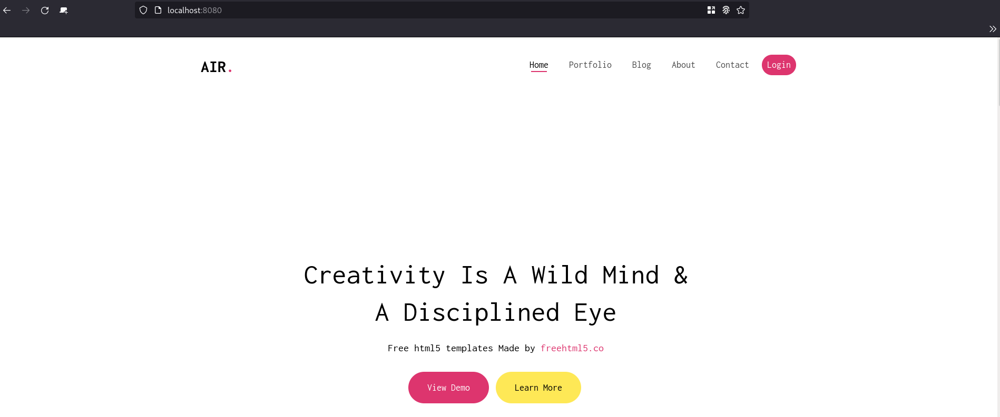

# API - Labo HTTP
Auteurs : Anthony Coke, Francesco Monti

## Etape 1: Serveur HTTP statique avec apache httpd
Nous avons décidé d'utiliser l'image *php:8.0-apache*. Le dossier contenant le site web statique est copié dans le répertoire
`/var/www/html` du conteneur.

Le fichier Dockerfile contient :
```
FROM php:8.0-apache

RUN apt-get update && apt-get install -y vim

COPY content/ /var/www/html/

EXPOSE 8080
```
Explications: l'image construite est basée sur php:8.0-apache. Le noyau est mis à jour et l'outil *vim* est installé. Le contenu du répertoire *content/* est copié dans le container à l'emplacement `/var/www/html/`. Finalement, le port *8080* est exposé.

L'image peut être construite à l'aide de la commande suivante: 

```
docker build -t infra/static .
```
Une fois cela fait, le container peut être démarré 

```
docker run -p 8080:80 infra/static
```

### Résultat
Maintenant, il peut être accédé via [localhost:8080](http://localhost:8080). 



## Etape 2: Serveur HTTP dynamique avec fastify.js


```js
// On dit qu'on utilise le module Chance qui permet de générer des données aléatoirement
import Chance from 'chance';
import Fastify from 'fastify';

const fastify = Fastify({
   logger: true
});
const chance = Chance();
const port = process.env.PORT;

/* Lors d'un accès à la racine du site, le serveur va générer une charge utile JSON et la renvoyer */
fastify.get('/', (request, reply) => {
   reply.send(generateJSON());
});

/* Le serveur écoute les requêtes sur le port 3000 */
const start = async () => {
   try {
      await fastify.listen(port, '0.0.0.0')
   } catch (err) {
      fastify.log.error(err)
      process.exit(1)
   }
}

/* Fonction qui génère une charge utile JSON avec des informations sur des vols de la compagnie aérienne United */
function generateJSON() {

	var numberOfPlanes = chance.integer({
		min: 0,
		max: 10
	});
	console.log(numberOfPlanes);
	var planes = [];
	for (var i = 0; i < numberOfPlanes; ++i) {
	
		var airline = "United";
		var callsign = airline.toUpperCase() + chance.integer({min:1, max:45});
		var flightId = chance.hash({length: 6, casing: 'upper'})
		var currentCoords = chance.coordinates();
		var currentTimeZone = chance.timezone();
		var pilot = chance.name();
		var licenseExpireDate = chance.year({min: 2005, max: 2035});
		
		planes.push({
			airline: airline,
			callsign: callsign,
			flightId: flightId,
			currentCoords: currentCoords,
			currentTimeZone: currentTimeZone,
			pilot: pilot,
			licenseExpireDate: licenseExpireDate
		});
		
	};
	console.log(planes);
	return planes;
}

// Démarre le serveur
start();

```

Cette fois nous utilisons un fichier `docker-compose.yml`. 
```
version: '3'
services:
  fastify:
    container_name: fastify-dynamic
    build: .
    ports:
      - "3000:3000"
    environment:
      - PORT=3000
```

```
FROM node:alpine

WORKDIR /opt/app

COPY --chown=node:node ./content/package*.json ./

RUN npm install

COPY --chown=node:node ./content .

USER node

ENTRYPOINT [ "node", "server.js" ]
```

### Résultat


## Etape 3: Reverse proxy avec apache (configuration statique)
Pour cette étape, nous utilisons un serveur

Le fichier de configuration *001-reverse-proxy.conf* permet de configurer le routage du proxy. Si l'URL correspond à *localhost:XXXX/api/json*, il y aura une redirection vers le container dynamic. Si l'URL correspond à la racine du nom de domaine, cette fois la requête ira vers le serveur statique.
```
<VirtualHost *:80>
	
	ServerName localhost

	ProxyPass "/api/json" "http://dynamic:3000/"
	ProxyPassReverse "/api/json" "http://dynamic:3000/"
	
	ProxyPass "/" "http://static:80/"
	ProxyPassReverse "/" "http://static:80/"
	

	ErrorLog ${APACHE_LOG_DIR}/error.log
	CustomLog ${APACHE_LOG_DIR}/access.log combined
	
</VirtualHost>
```

Si l'URL ne correspond pas à celles spécifiées précédèment, le serveur ne renvoit rien.
```
<VirtualHost *:80>
</VirtualHost>
```


```
version: '3'
services:
  reverse-proxy:
    container_name: reverse-proxy
    build: ./reverse-proxy
    ports:
      - "8080:80"
    depends_on:
      - static
      - dynamic
  static:
    container_name: static
    build: ./static
  dynamic:
    container_name: dynamic
    build: ./dynamic
    environment:
      - PORT=3000
```


## Etape 4: Requêtes AJAX avec JQuery

```html
	<header id="fh5co-header" class="fh5co-cover js-fullheight" role="banner">
		<div class="overlay"></div>
		<div class="container">
			<div class="row">
				<div class="col-md-8 col-md-offset-2 text-center">
					<div class="display-t js-fullheight">
						<div class="display-tc js-fullheight animate-box" data-animate-effect="fadeIn">
              
							<h1>Welcome to my API website !</h1>
							<h2>I hacked the FAA, so now I can access the coords of every flight ! Here is an example ...</h2>
							<p class="json-app">There's nothing here ... :(</p>
              
						</div>
					</div>
				</div>
			</div>
		</div>
	</header>
```

```html
	<!-- Custom script to load flights information -->
	<script src="js/flights.js"></script>

	</body>
</html>

```

```js
$(function() {
	console.log("Loading flights...");
	
	function loadFlights() {
		$.getJSON("/api/json/", function( flights ) {
			console.log(flights);
			var message = "No flights recorded...";
			if (flights.length > 0) {
				message = "Airline: " + flights[0].airline + ", Callsign:  " +
					flights[0].callsign + ", FlightId: " + 
					flights[0].flightId + ", Current Coords: " +
					flights[0].currentCoords + ", Pilot Name: " + 
					flights[0].pilot + ", License Expiration Date: " +
					flights[0].licenseExpireDate; 
			}
			$(".json-app").text(message);
		});
	};
	loadFlights();
	setInterval(loadFlights, 2000);
});
```

```
version: '3'
services:
  reverse-proxy:
    container_name: reverse-proxy
    build: ./reverse-proxy
    ports:
      - "8080:80"
    depends_on:
      - static
      - dynamic
  static:
    container_name: static
    build: ./static
  dynamic:
    container_name: dynamic
    build: ./dynamic
    environment:
      - PORT=3000
```


## Etape 5: Configuration dynamique du reverse proxy
Les fonctionnalités demandées à cette étape ont déjà été implémentées à l'étape 3.

# Étapes supplémentaires

## Répartition de charge : plusieurs noeuds serveurs

## Répartition de charge : round-robin vs sticky sessions

## Gestion dynamique du cluster

## Interface de gestion utilisateur

