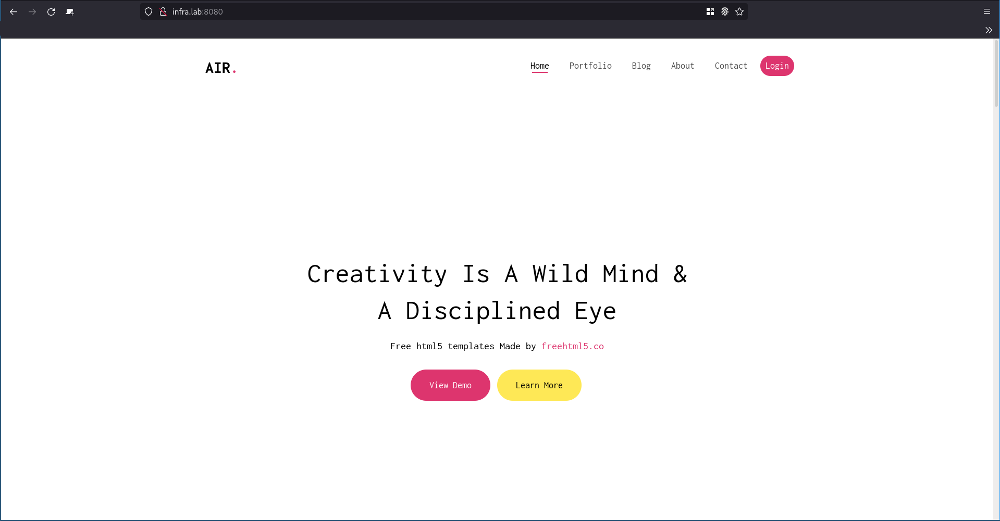

# API - Labo HTTP
## Étape 3
### Description
### Marche à suivre

Il faut dans un premier temps créer un répertoire (que nous nommerons **docker-reverse-proxy**) à l'endroit où vous souhaitez réaliser l'étape (idéalement dans le même répertoire où se trouve le dossier de l'étape 1 et 2). 

Puis, se rendre dans ce répertoire au moyen de la commande `cd <nom_du_répertoire>`.

Une fois dedans, créer un fichier Dockerfile (`touch Dockerfile`) et un répertoire *conf* 
(`mkdir conf`).

Se rendre dans le répertoire *conf*, y créer un nouveau répertoire *sites-available* puis s'y rendre.

Créer deux fichiers *000-default.conf* et *001-reverse-proxy.conf*.
Dans le premier fichier, insérer les lignes suivantes :

```
<VirtualHost *:80>
</VirtualHost>
```
TODO: expliquer pourquoi ça ?

et dans le deuxième :
```
<VirtualHost *:80>
	
	ServerName infra.lab

	ProxyPass "/api/json/" "http://172.17.0.3:3000/"
	ProxyPassReverse "/api/json/" "http://172.17.0.3:3000/"
	
	ProxyPass "/" "http://172.17.0.2:80/"
	ProxyPassReverse "/" "http://172.17.0.2:80/"
	

	#ErrorLog ${APACHE_LOG_DIR}/error.log
	#CustomLog ${APACHE_LOG_DIR}/access.log combined
	
</VirtualHost>

```
TODO: expliquer ProxyPass

Démarrer deux conteneurs basé sur les deux anciennes images *infra/static* et *infra/dynamic* sans faire de port mapping.

```
docker run -d --name apache_static infra/static
docker run -d --name express_dynamic infra/dynamic
```
Les deux conteneurs ne sont plus accessibles par *localhost:8080* et *localhost:3000*.

Construire l'image :
```
docker build -t infra/reverse_proxy .
```
Démarrer le conteneur :
```
docker run -d -p 8080:80 --name apache_rp infra/reverse_proxy
```
Il faut également modifier le fichier hosts (configuration DNS) situé dans `/etc/` en y ajoutant la ligne :
```
127.0.0.1 infra.lab
```

### Résultats

Maintenant si l'on tente d'accéder à `http://infra.lab:8080` sur le navigateur, le site web s'affiche. 



Et si l'on met plutôt `http://infra.lab:8080/api/json/`, on voit bien les données JSON !


Inconvénient : ip statique, respecter l'ordre.

