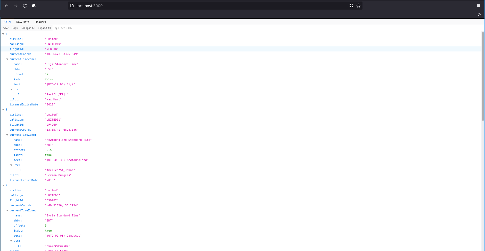

# API - Labo HTTP
## Étape 2
### Description
### Marche à suivre

Le fichier *server.js* contient le code qui lance le serveur et répond aux requêtes HTTP. Il se compose des éléments suivants :

```js
// On dit qu'on utilise le module Chance qui permet de générer des données aléatoirement
import Chance from 'chance';
import Fastify from 'fastify';

const fastify = Fastify({
   logger: true
});
const chance = Chance();
const port = process.env.PORT;

/* Lors d'un accès à la racine du site, le serveur va générer une charge utile JSON et la renvoyer */
fastify.get('/', (request, reply) => {
   reply.send(generateJSON());
});

/* Le serveur écoute les requêtes sur le port 3000 */
const start = async () => {
   try {
      await fastify.listen(port, '0.0.0.0')
   } catch (err) {
      fastify.log.error(err)
      process.exit(1)
   }
}

/* Fonction qui génère une charge utile JSON avec des informations sur des vols de la compagnie aérienne United */
function generateJSON() {

	var numberOfPlanes = chance.integer({
		min: 0,
		max: 10
	});
	console.log(numberOfPlanes);
	var planes = [];
	for (var i = 0; i < numberOfPlanes; ++i) {
	
		var airline = "United";
		var callsign = airline.toUpperCase() + chance.integer({min:1, max:45});
		var flightId = chance.hash({length: 6, casing: 'upper'})
		var currentCoords = chance.coordinates();
		var currentTimeZone = chance.timezone();
		var pilot = chance.name();
		var licenseExpireDate = chance.year({min: 2005, max: 2035});
		
		planes.push({
			airline: airline,
			callsign: callsign,
			flightId: flightId,
			currentCoords: currentCoords,
			currentTimeZone: currentTimeZone,
			pilot: pilot,
			licenseExpireDate: licenseExpireDate
		});
		
	};
	console.log(planes);
	return planes;
}

// Démarre le serveur
start();

```
On peut tester le code à l'aide de la commande `node server.js` si les dépendances sont installées. La console devrait afficher: `Server listening at http://0.0.0.0:3000`. Si on accède à `localhost:3000`, le navigateur affiche également le tableau JSON.

Un fichier docker-compose est créé afin de faciliter la création de l'image et le lancement de l'application. Il contient le service *fastify* qui représente le serveur.

```yaml
version: '3'
services:
  fastify:
    container_name: fastify-dynamic
    build: ./content # On build le Dockerfile qui se trouve dans content/
    ports:
      - "3000:3000" # On expose le port 3000 de l'host et on le lie au port 3000 du container
    environment:
      - PORT=3000 # On signale à Fastify le port qu'on veut utiliser
```

Le Dockerfile utilise une image _node_ pour exécuter le fichier js. On profite de la mise en cache des étapes de build pour copier et installer les dépendances avant de copier les fichiers. On évite ainsi de recréer les étapes d'installation des dépendances si on modifie uniquement le code.

```dockerfile
FROM node:alpine

# On se place dans le dossier /opt/app
WORKDIR /opt/app

# On copie uniquement package et package-lock.json pour accélérer le temps de build
COPY --chown=node:node package*.json .

# On installe toutes les dépendances
RUN npm install

# On copie les fichiers restants
COPY --chown=node:node . .

USER node

# On exécute le serveur grâce à la commande node
ENTRYPOINT [ "node", "server.js" ]
```

Une fois cela fait, l'image peut être créée. Pour se faire, exécuter la commande suivante dans le même répertoire que le fichier docker-compose.yaml :
```
docker compose build
```

Après la construction de l'image, il est possible de démarrer un conteneur basé sur cette dernière. Utiliser la commande : 

```
docker compose up
```

### Résultats

On peut vérifier le comportement en se rendant sur l'adresse `localhost:3000`.
On y reçoit bien la charge utile JSON qui est générée aléatoirement et de taille différente à chaque rafraîchissement.




