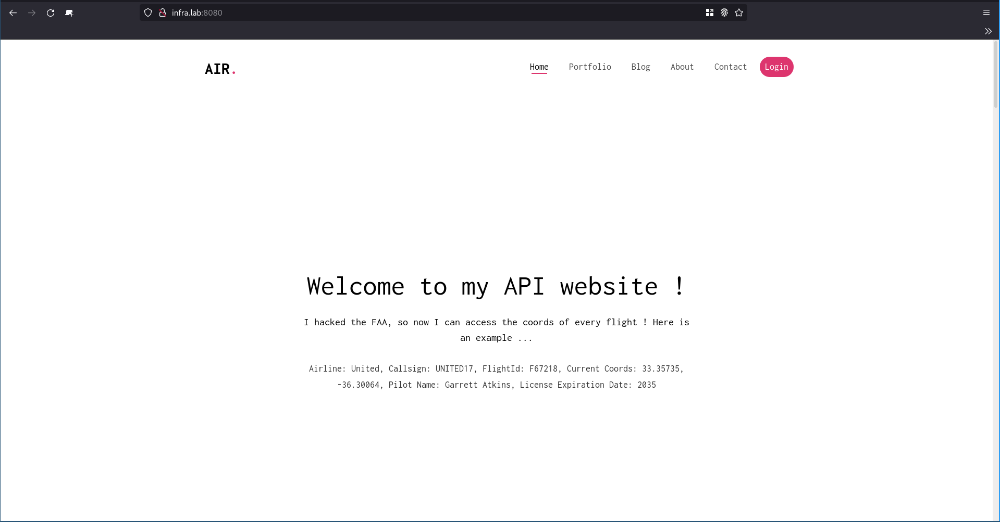

# API - Labo HTTP
## Étape 4
### Description

### Marche à suivre

Dans le répertoire *content*, modifier le fichier index.html. Ajouter les lignes suivantes dans la balise `<header>`. Ajouter un nom de classe (ici : json-app) à une balise paragraphe. Cela permettra de sélectionner la balise à modifier avec Javascript.

```html
	<header id="fh5co-header" class="fh5co-cover js-fullheight" role="banner">
		<div class="overlay"></div>
		<div class="container">
			<div class="row">
				<div class="col-md-8 col-md-offset-2 text-center">
					<div class="display-t js-fullheight">
						<div class="display-tc js-fullheight animate-box" data-animate-effect="fadeIn">
              
							<h1>Welcome to my API website !</h1>
							<h2>I hacked the FAA, so now I can access the coords of every flight ! Here is an example ...</h2>
							<p class="json-app">There's nothing here ... :(</p>
              
						</div>
					</div>
				</div>
			</div>
		</div>
	</header>
```
À la fin du fichier, ajouter le script flight.js comme suit :

```html
	<!-- Custom script to load flights information -->
	<script src="js/flights.js"></script>

	</body>
</html>

```
Se rendre dans le répertoire *js/* et y créer un fichier *flights.js*. Insérer les lignes suivantes.

```js
$(function() {
	console.log("Loading flights...");
	
	function loadFlights() {
		$.getJSON("/api/json", function( flights ) {
			console.log(flights);
			var message = "No flights recorded...";
			if (flights.length > 0) {
				message = "Airline: " + flights[0].airline + ", Callsign:  " +
					flights[0].callsign + ", FlightId: " + 
					flights[0].flightId + ", Current Coords: " +
					flights[0].currentCoords + ", Pilot Name: " + 
					flights[0].pilot + ", License Expiration Date: " +
					flights[0].licenseExpireDate; 
			}
			$(".json-app").text(message);
		});
	};
	loadFlights();
	setInterval(loadFlights, 2000);
});
```
Quand le fichier est chargé, la fonction loadFlights est appelée toutes les 2 secondes. Cette fonction récupère les données JSON retournée par la page */api/json*, elle sélectionne le premier vol dans le tableau reçu et compose une chaîne de caractères avec les données. Elle modifie ensuite le texte contenu dans la balise ayant comme classe *json-app*.

Une fois cela fait, effectuer les commandes suivantes s'être assurée qu'aucun vieux conteneur n'existe :
```
docker build -t infra/ajax-s4 .
docker run -d --name apache_ajax infra/ajax-s4
docker run -d --name express_json infra/express-s2
docker run -d -p 8080:80 --name apache_rp infra/rp-s3  
```
### Résultats
Il est maintenant possible d'accéder au site web mis à jour dynamiquement pas le script JS.




